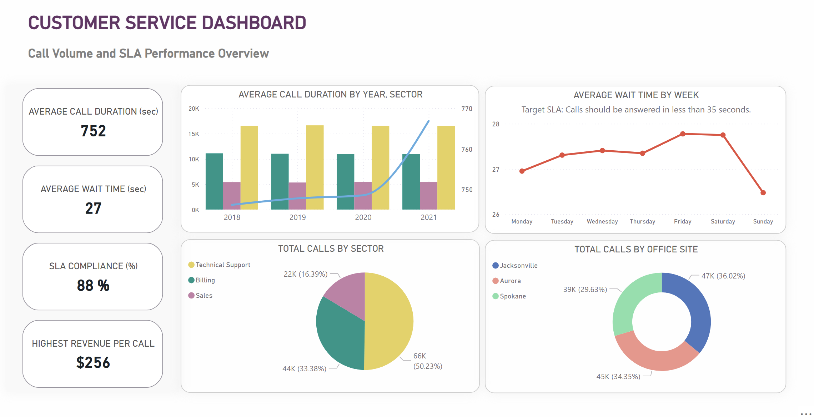
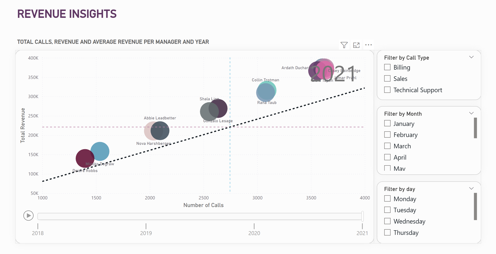
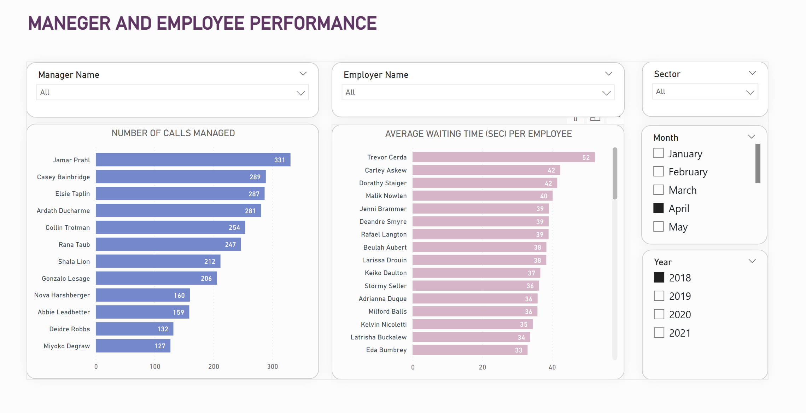

# 📞 Customer Service Dashboard - Power BI 

This project aims to create a Power BI dashboard to evaluate SLA performance, revenue trends, and team efficiency using anonymized call center data from 2018 to 2021. The dashboard supports the regional director in making data-driven decisions to improve customer service performance and enhance operational efficiency.

Note: This dashboard was created as part of the certification exam for the Data Analyst course.

## 📊 Dashboard Features
This Power BI dashboard is organized into three main analysis axes:

1. **Customer Service Overview**
   - Total number of calls by sector, site, and weekday
   - Average call duration and wait time
   - SLA compliance rate (Within SLA vs Outside SLA)
   - Key metrics such as highest revenue and call center performance

2. **Revenue Insights**
   - Total and average revenue per manager and year
   - Revenue trends from 2018 to 2021
   - Revenue breakdown by sector and team
   - Filters to explore by month, weekday, and call type

3. **Manager & Employee Performance**
   - Number of calls managed per manager
   - Average wait time per employee
   - Sector and time-based filters to compare team efficiency
---

## 🖼 Dashboard Previews

### 1. Customer Service Overview

> Shows total calls by sector, SLA compliance rate, and average call duration.

### 2. Revenue Insights

> Displays revenue trends across sectors and years.

### 3. Manager & Employee Performance

> Highlights differences in call volume and wait time per manager.

---

## 🔍 Key Insights

- SLA compliance remained stable at 88%, indicating generally good responsiveness, though there’s room for optimization to reach higher service levels.
- 2018 had the highest Total Calls (33,057), while 2021 had the highest Total Revenue ($3,358,570), showing improved efficiency and value per call.
- In 2021, Ardath Ducharme handled the highest number of calls (14,533), nearly 148% more than the lowest-performing manager, highlighting a significant performance gap among team leaders.

---

## 📎 Files & Deliverables

- `Customer Service Dashboard.pbix` – Power BI file  
- `screenshots/` – Dashboard visuals  
- `README.md` – Full project overview  

---

## 💬 What I Learned

- Used DAX to calculate SLA performance and revenue KPIs  
- Applied Power Query to clean and merge multi-table data  
- Designed dashboard layout for business decision-makers  
- Gained experience presenting service performance and revenue trends

---

## 🛠 Tools Used

Power BI • Power Query • DAX • Excel
